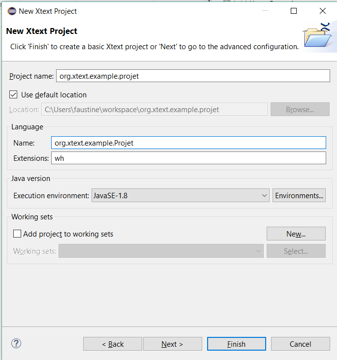
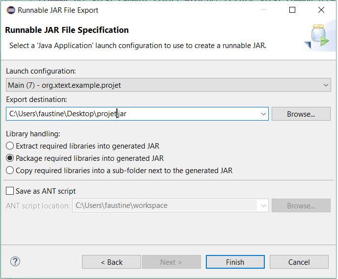

# COMP-JS

Ceci est le README du projet. Il faut y mettre toutes les infos concernant l'installation et l'utilisation du Compilateur.
Feel free to add more ;)

Pour installer le projet correctement :
Télécharger Eclipse et le plugin xtext.
Créer un nouveau projet xtext appelé "org.xtext.example.projet", avec comme extension ".wh"

Ensuite, il faut importer les fichiers donnés sur le github :  

GenerateProjet.mwe2 : dans org.xtext.example.projet -> src -> org.xtext.example   
Projet.xtext : dans org.xtext.example.projet -> src -> org.xtext.example  
Ensuite, faire "generate artifacts" sur Projet.xtext.   
Main.java : dans org.xtext.example.projet -> src -> org.xtext.example.generator  

Le fichier Projet.xtext contient la grammaire que l'on souhaite utiliser. Le fichier GenerateProject.mwe2 n'est pratiquement pas modifié : on ajotue les lignes "generator = {generateJavaMain = true}" afin d'avoir un fichier "Main.java".  
Ensuite, on modifie "Main.java" afin d'avoir un parser plus complet.  
Après avoir run le main une fois, on peut exporter le projet "org.xtext.example.projet" en .jar avec clic droit -> export -> Runnable JAR File  
  
Ce jar peut ensuite être utilisé comme parser :   
  

Sont également disponibles sur le repo le runnable JAR "projet.jar", et les deux fichiers "right.wh" et "wrong.wh" qui sont respectivement corrects et incorrects afin de pouvoir les tester.  
